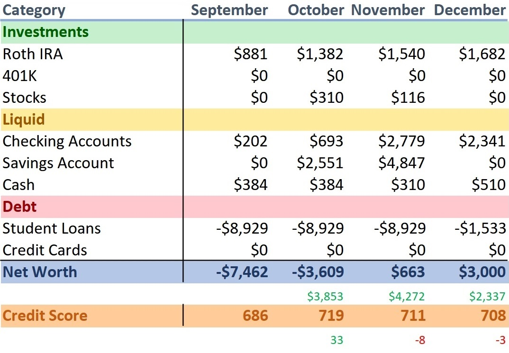

<h1>2020 Annual Net Worth Review</h1>

 

<h2>December 28, 2020</h2>

    This post marks the start of my bookkeeping journey to track my net worth.
      
    For some context around this time of my life — I graduated in May with a Computer Science degree, almost $9k in debt, and no job lined up. After hunting for 3 months, I finally landed a job in September. With this new source of income, I finally had a reason to start tracking my finances.
      
    One monumental event happened this year — my net worth went into the positive for the first time since college! It probably won't stay above zero for long, but it's worth celebrating.
     
    I'm still living with my parents, hence why I'm able to pay off my loans so fast. My net worth is increasing by ~$3,500/month. My goal right now is to pay off all my debt before it has a chance to accrue interest. If I do, it'll mean that I borrowed money for school interest free! I think it's more than doable, given my current trajectory, and the fact that there is a 6-month grace period on the loans during which interest does not accrue.
      
    Let's see what 2021 has in store.
       
    - Tommy

    finance

