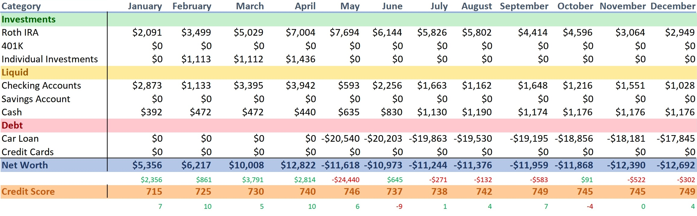
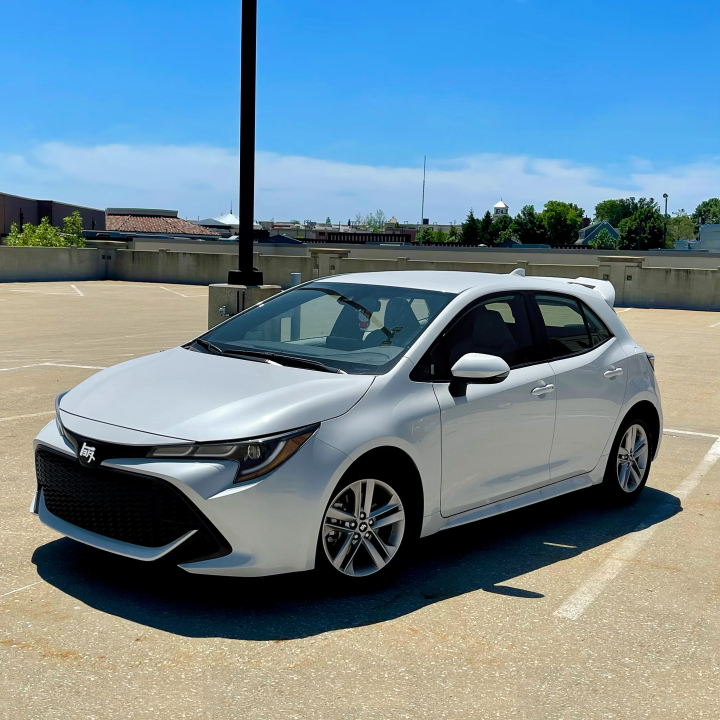

<h1>2021 Annual Net Worth Review</h1>

 

    

<h2>December 28, 2021</h2>

    Man, what a year this was.
      
    A few points of interest worth talking about — I quit my job without a plan-B, and I bought a brand new car during the chip shortage.
      
    That job that I landed in September of last year didn't turn out so great. After only 8 months, I decided that my mental health was worth more than the stable income I was making there. To make matters worse, my car broke down during the silicon shortage. Because supply wasn't meeting demand, used car prices skyrocketed to the same price as brand new cars. Since my local dealership had an agreement with the manufacturer to cap new car prices at MSRP, it made the most sense to buy the new car rather than a used one that would've costed the same amount. So I had no choice but to do it; I cashed out on all my Dogecoin and used it towards the down-payment on a 2021 Corolla Hatchback. It's a pretty nice car, but I wish I could've bought a used car for half that price.

    

    I really foreshadowed this in my last update. My net worth was finally in the positive, but I had a feeling it wasn't going to last.
    I ended the year with no job, and I'm slowly withdrawing the principle from my Roth IRA to make the car payments.
      
    Hopefully, I can find a better job in 2022 before I deplete my funds completely.
       
    - Tommy

    finance

