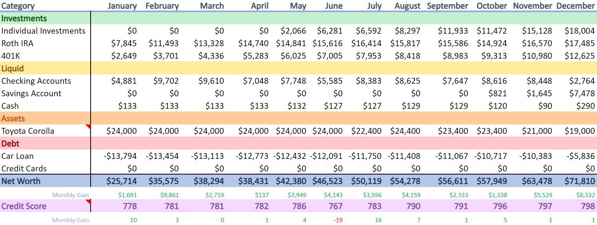

<h1>2023 Annual Net Worth Review</h1>

 

<h2>December 28, 2023</h2>

    This year is what I'd call "smooth sailing".
     
    To summarize my last update, I landed my dream job and moved to Las Vegas.
      
    2023 represents the first time I've held a job for the entirety of the calendar year.
     
    This is what I've always wanted, since starting college. I have a steady job, with my own place, and no drama or setbacks. This update will be very boring as nothing really happened, but that's not necessarily bad. In fact, it's the first time I've felt at ease in a long time.
     
    So, let's talk about what went well, along with some things that are of concern.
      
    I started the year with a net worth of ~$25k and grew it to ~$70k; that's a growth of over $46k. I was able to do this by investing half of my paychecks immediately as they come in.
     
    Currently, my goal is to build up enough money for a house here in Nevada. I've actually been eyeing the real estate market just to stay in touch with the state of the market. It does not look good. With record high interest rates, even with a perfect credit score, it's ridiculously high. Even with that in mind, I still want to buy a house as soon as possible. I could always refinance when the market is better, so I'd rather prioritize locking in the price of the house itself.
      
    Unfortunately, it'll be at least 2 years before I have enough for a down-payment. My goal is to put at least 20% down. Until then, my plan is to simply continue doing what I've been doing.
       
    - Tommy

    finance

