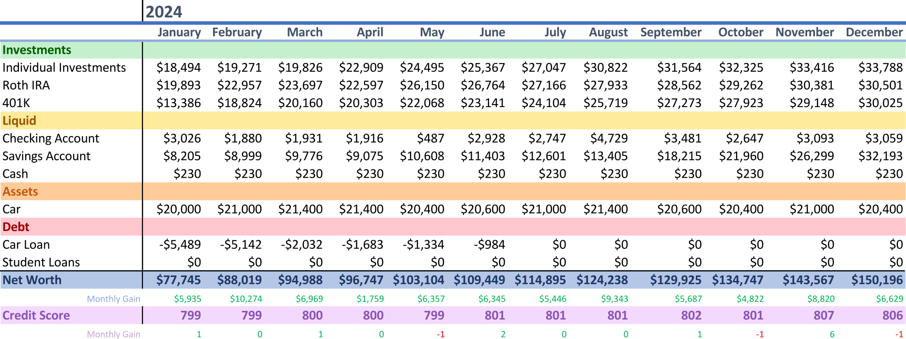

<h1>2024 Annual Net Worth Review</h1>

 

<h2>December 28, 2024</h2>

    A couple of milestones were reached this year.
     
    I became debt-free by paying off my car early, my net worth crossed over to 6-figures, and I reached an 800 credit score.
      
    Last year, I said my only goal was to just continue down my current path slowly and steadily, and that's exactly what I've done. I'm starting to see the payoff of it. Although, the "slowly" part can be discouraging at times.
      
    I still have the goal of buying a house by end of 2025. I've even started taking steps towards it by easing off investments, and putting my money into a high-yield savings account instead. This does 2 things: it minimizes my risk by guaranteeing a return, and it also minimizes my taxes when I cash out on my investments to put towards the down payment. By halting investments 1 year before I buy a house, I will only have to pay long-term capital gains tax on the stocks I sell.
      
    My apartment lease ends in October 2025, so I'll need to house-hunt at least 3 months before that. Sadly, no matter how aggressively I save, that's not enough time for me to accumulate enough for a 20% down payment. My options are to rent for a few additional months, or buy a house with less than 20% down and pay PMI. I'm leaning towards the latter option. I'd only need to pay PMI for a few months until I've built enough equity, and it'll be cheaper than renting month-by-month.
      
    If all goes well, my next update will be as a new homeowner. But worst case scenario, I have a bunch of cash piled up so that I'll be ready to make a purchase as soon as the perfect house comes up. I'm very optimistic though. With my 800+ credit score, I should have no problems at all getting a mortgage. My only worry is either not finding the perfect house, or being out-bidded on the perfect house. We'll see how it goes.
       
    - Tommy

    finance

